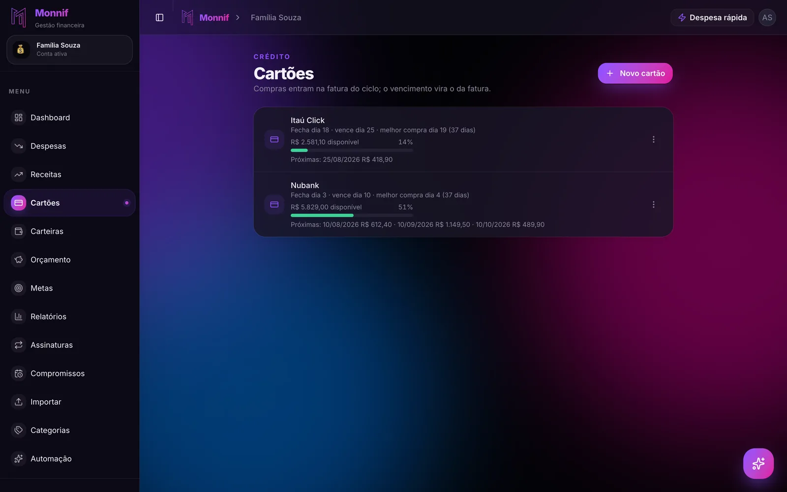

Procurar **app de gestão financeira** devolve dezenas de nomes e quase nenhuma diferença
visível. Todos mostram gráfico de pizza, todos prometem controle, todos têm a tela bonita no
print da loja. A diferença não está ali — ela aparece no segundo mês, quando o entusiasmo
acabou e o que sobrou foi o atrito.

Este texto é a lista de perguntas que separa os dois grupos. Nenhuma delas é sobre design.

## Antes: o que "gestão financeira" quer dizer na prática

A expressão é grande e vaga. Na vida real ela é quatro tarefas, e um app só é bom na medida
em que resolve as quatro:

1. **Registrar** o que aconteceu — o gasto, a entrada, a parcela.
2. **Enxergar** para onde o dinheiro está indo, por categoria e por período.
3. **Prever** o que vem: a fatura que fecha, a conta que vence, o dia em que o saldo aperta.
4. **Combinar** com quem divide a casa, quando não é uma pessoa só.

Quase todo mundo começa tentando resolver isso com uma das três ferramentas abaixo, e cada
uma falha num lugar previsível:

| Ferramenta | Registra | Enxerga | Prevê | Combina |
|---|---|---|---|---|
| Planilha | Você digita tudo | Bem, se a fórmula estiver certa | Só se você montar | Uma pessoa por vez, na prática |
| App do banco | Sozinho, mas só aquele banco | Categoria genérica | Não — olha para trás | Não |
| App de gestão financeira | Depende do app | Categoria sua | Depende do app | Depende do app |

A planilha morre de manutenção. O app do banco morre de escopo: ele conhece o dinheiro que
passou por ele e ignora o cartão da outra instituição, o dinheiro em espécie e a conta do seu
companheiro. Sobra a terceira opção — e é aí que as sete perguntas entram.

## 1. Ele conta o que ainda não aconteceu?

Esta é a primeira porque é a que mais elimina.

Extrato é passado. Um app que só mostra o que já saiu da conta é um retrovisor bem
desenhado: ele te conta em 3 de abril que março foi ruim, o que não te ajudou em 3 de março.

O que você precisa enxergar é o mês inteiro, incluindo o aluguel que vence dia 10, a fatura
que fecha dia 28 e a parcela número 4 de 10 que ninguém lembra que existe. **Previsto e
realizado precisam conviver na mesma tela.** Se o app só soma o que foi pago, ele nunca vai
te avisar de nada a tempo — e avisar a tempo é o trabalho inteiro.

Teste rápido na loja: lance uma despesa com vencimento daqui a duas semanas e veja se o
número do mês muda. Se não mudou, é retrovisor.

## 2. A compra no cartão cai na fatura certa?

Cartão de crédito é onde a maioria dos apps se entrega.

Uma compra feita dia 28 pode entrar na fatura que vence daqui a 40 dias, e uma compra
parcelada em 10x precisa aparecer **mês a mês**, cada parcela no mês em que ela vai ser paga
— não como um valor cheio no dia da compra. App que trata o cartão como "mais uma conta"
erra os dois casos, e o erro sempre aparece para o lado otimista.

Isso não é detalhe técnico: é a diferença entre saber e não saber quanto do seu ano que vem
já está vendido. Os dois textos que explicam a mecânica inteira são
[o ciclo da fatura](/blog/ciclo-da-fatura/) e
[em 10x sem juros: o mês que vem já está gasto](/blog/em-10x-sem-juros/).

## 3. Quantas pessoas cabem na conta?

Se você mora sozinho e não divide nada com ninguém, pule esta.

Se não é o caso — e para a maioria não é — a pergunta certa não é "dá para compartilhar?",
é **"dá para compartilhar sem compartilhar a senha?"**. Muitos apps resolvem o casal do jeito
preguiçoso: os dois usam o mesmo login. Funciona até alguém precisar trocar a senha, até um
dos dois querer ver a própria conta separada, até você precisar saber quem lançou aquilo.

O que procurar: **logins separados, mesma conta financeira, e um registro de quem fez o quê.**
Papéis diferentes (quem só lança, quem também convida) são o refinamento seguinte. O assunto
tem um texto só dele em
[gestão financeira para casais](/blog/gestao-financeira-para-casais/).

## 4. Ele sabe onde o dinheiro está — não só quanto você tem?

Um saldo único é quase sempre uma mentira confortável.

Os seus R$ 9.000 podem ser R$ 1.200 no corrente, R$ 6.500 na poupança que é a reserva,
R$ 900 na corretora e R$ 400 em espécie. Somados, dão a sensação de folga. Separados, contam
que o mês está apertado e a reserva não é para ser tocada.

Um app que só tem uma caixa te obriga a fazer essa separação de cabeça, todo mês, para sempre.
Um app com **carteiras** faz isso uma vez. E tem um detalhe que quase ninguém acerta: mover
dinheiro entre duas carteiras suas **não é gasto nem ganho** — se o app conta transferência
como despesa, todo relatório seu nasce errado. Isso está destrinchado em
[gestão de carteiras](/blog/gestao-de-carteiras/).

## 5. Quanto tempo custa lançar um gasto?

Aqui morre a maioria dos aplicativos de controle financeiro, e morre por um motivo bobo:
**o gasto acontece na rua e o app fica em casa.**

Faça a conta do atrito. Abrir o app, esperar carregar, achar o botão, escolher categoria,
escolher carteira, escolher data, salvar: dez a quinze segundos e seis decisões. Multiplique
por seis lançamentos por dia e por trinta dias. Não é o tempo que quebra — são as seis
decisões, repetidas, num momento em que você está na fila com a sacola na mão.

Todo app que exige que você lembre de abrir o app perde para o esquecimento. A saída é
mudar o **lugar** de anotar, não a força de vontade: um assistente que aceita a frase inteira
("almoço 38 no débito") em vez de seis campos, e que mora onde você já está — o que hoje, no
Brasil, significa o WhatsApp. Tem texto sobre os dois lados disso:
[anotar gasto pelo WhatsApp](/blog/anotar-gasto-pelo-whatsapp/) e
[gestão financeira pelo WhatsApp](/blog/gestao-financeira-pelo-whatsapp/).

## 6. Ele pede a senha do seu banco?

Se pede, feche.

Existe um jeito legítimo de um app ler a sua conta bancária, que é o Open Finance, com
consentimento revogável e sem senha trafegando. E existe o jeito antigo — você entrega usuário
e senha para um robô entrar por você. O segundo é comum, é mais fácil de implementar e
transfere todo o risco para você.

O caminho mais simples e o mais seguro é o mesmo: **o extrato que você mesmo baixa no site do
banco.** OFX ou CSV, importado no app, três meses de histórico em cinco minutos e nenhuma
credencial sua em lugar nenhum. O passo a passo está em
[importar extrato sem digitar](/blog/importar-extrato-sem-digitar/).

## 7. O que trava quando você não paga?

Todo app grátis tem um modelo de negócio. A pergunta honesta não é "é grátis?", é **"o que
acontece com os meus dados quando eu parar de pagar — ou quando eu nunca começar?"**.

Três respostas ruins, em ordem de gravidade:

- **A conta vira somente leitura e você não consegue exportar.** Seus lançamentos viraram
  refém.
- **O grátis é um teste de 7 ou 14 dias.** Não é plano, é vitrine.
- **O produto é você.** Sem assinatura e sem anúncio declarado, o dinheiro está vindo de algum
  lugar, e "algum lugar" costuma ser o seu dado.

O que procurar: plano grátis que não expira, exportação sempre disponível, e limites que
travam **o que você cria a mais**, nunca o que você já criou.

## O teste dos 60 dias

Nenhuma dessas sete perguntas se responde olhando print. Todas se respondem em dois meses de
uso — e dois meses é exatamente o prazo em que os apps ruins se revelam, porque o primeiro mês
todo mundo aguenta.

Faça assim: escolha um, importe os últimos três meses de extrato para não começar do zero,
lance tudo por 60 dias e, no dia 61, responda a uma pergunta só — **"em que dia deste mês o
meu saldo fica mais apertado?"**. Se o app não responde isso, ele não é um app de gestão
financeira. É um caderninho com gráfico.

## Como isso fica no Monnif

O Monnif nasceu dessas sete perguntas, e vale dizer onde cada uma aterrissa.

**Previsto e realizado convivem.** O [dashboard](/docs/dia-a-dia/dashboard/) abre com a sobra
prevista do mês contando tudo que está lançado, pago ou não. A aba **Fluxo** desenha o saldo
dia a dia e marca a data em que a conta cruza o zero — que é a resposta do teste dos 60 dias,
com semanas de antecedência.

**O cartão tem ciclo de verdade.** Cada [cartão](/docs/dia-a-dia/cartoes/) tem dia de
fechamento e de vencimento, a compra cai na fatura correta sozinha e a parcela aparece em cada
mês futuro que ela vai ocupar.

**A conta é compartilhada por padrão**, com [logins separados e papéis](/docs/conta/usuarios/)
— Dono, Admin e Membro — e o [histórico](/docs/dados/historico/) guarda quem lançou o quê.

**As [carteiras](/docs/dia-a-dia/carteiras/) separam onde o dinheiro está**, e transferência
entre elas não entra em relatório de gasto.

**O lançamento cabe numa frase**, no app ou [no WhatsApp](/recursos/whatsapp/), por texto ou
por áudio.

**Ninguém pede a sua senha do banco.** Não existe conexão bancária: quem quer evitar digitação
[importa o extrato](/docs/dados/importar/) baixado no próprio banco.

**O plano grátis não expira** e não pede cartão no cadastro — conta compartilhada, assistente
no WhatsApp e relatórios estão nele. O que os planos pagos mudam são os tetos, e está tudo
listado em [preços](/precos/). Parar de pagar devolve a conta para o grátis sem apagar nada.

## A pergunta que fica

Você não precisa do app com mais recursos. Precisa do app que você ainda vai estar abrindo
em março — e isso se decide no atrito de lançar, não na tela de relatório.

Escolha pelo segundo mês.
