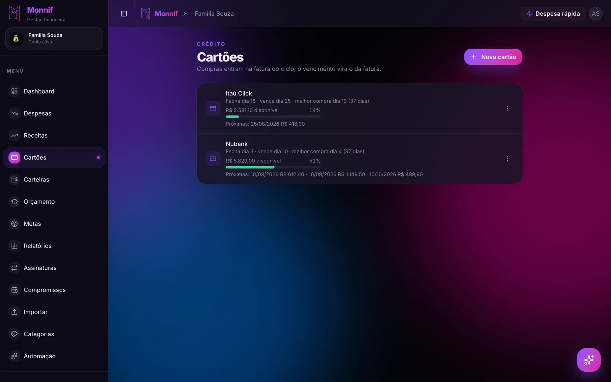
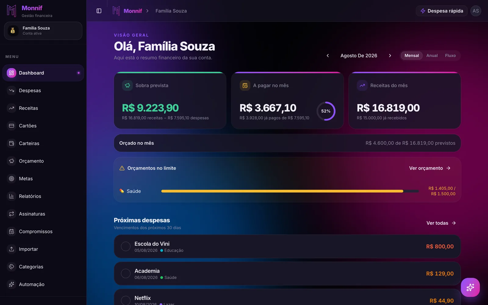

A pergunta mais cara do varejo brasileiro tem cinco palavras: **"em quantas vezes o senhor quer?"**

Ela não parece uma pergunta sobre dinheiro. Parece uma pergunta sobre logística, do mesmo
tipo que "com sacola?". Você responde no automático, sai da loja e não pensa mais nisso.
O problema é que essa resposta não terminou ali — ela vai continuar acontecendo todo mês,
por quase um ano, dentro de uma fatura que você ainda nem viu.

## Parcelar não é dividir, é agendar

Uma compra de R$ 1.890 em 10x não vira dez compras de R$ 189. Vira **uma compra de
R$ 1.890 e um compromisso de nove meses**. O dinheiro é o mesmo, o que muda é a data em
que ele sai — e a data em que ele sai é justamente a informação que nenhum extrato do mês
mostra bem.

É por isso que a sensação engana. No mês da compra, o total das despesas quase não se mexe:
R$ 189 se perdem no meio de mercado, combustível e farmácia. A decisão de R$ 1.890 aconteceu,
mas o retrato do mês registra apenas 10% dela.

O resto ficou pendurado no futuro, e o futuro não aparece na tela de hoje.

## O problema nunca é uma parcela

Uma compra parcelada é administrável. Ninguém quebra por causa de uma geladeira.

O que derruba o orçamento é o **empilhamento**: quatro ou cinco decisões tomadas em meses
diferentes, cada uma inofensiva sozinha, que passam a coexistir dentro da mesma fatura.

| Compra | Quando | Valor | Parcelas | Cai por mês |
|---|---|---|---|---|
| Geladeira | Março | R$ 3.200 | 10x | R$ 320 |
| Pneus | Maio | R$ 1.800 | 6x | R$ 300 |
| Celular | Junho | R$ 4.500 | 12x | R$ 375 |
| Notebook | Julho | R$ 2.400 | 8x | R$ 300 |

Nenhuma dessas linhas exigiu coragem. Juntas, elas viraram **R$ 1.295 por mês** que ninguém
contratou de propósito, saindo de uma renda que já tinha dono. E a última delas só termina
em maio do ano que vem.

Repare no detalhe mais desconfortável da tabela: em agosto, três dessas compras já são
passado. A geladeira gela há cinco meses, os pneus rodaram o inverno inteiro. A satisfação
acabou; a parcela não.

## O limite mente sobre o seu saldo

O limite do cartão é o mecanismo que mantém tudo isso invisível.

Ele volta um pouco todo mês, conforme as parcelas vão sendo pagas, e essa recomposição é
lida pelo cérebro como folga. Não é. É o oposto: o limite que voltou é exatamente a prova
de que você pagou mais uma prestação de algo que já consumiu.

Um limite de R$ 12.000 com R$ 7.000 em parcelas contratadas não é "R$ 5.000 disponíveis".
É **R$ 5.000 disponíveis e R$ 7.000 de dívida já assinada**, só que a segunda metade da
frase não cabe no aplicativo do banco.

## Os três números que resolvem

Não é preciso planilha. Um diagnóstico honesto cabe em três perguntas:

1. **Quanto ainda falta pagar** de tudo que já está parcelado?
2. **Quanto disso cai por mês**, somando todas as compras?
3. **Até quando** — qual é a data da última parcela em aberto?

O número 2 é o que dói, porque ele é uma mensalidade que você não escolheu ter. O número 3
é o que assusta, porque quase sempre está mais longe do que a memória sugere.

No Monnif, a tela de [Cartões e faturas](/docs/dia-a-dia/cartoes/) responde aos três de uma
vez: cada cartão mostra a barra de limite — que **já conta as parcelas futuras contratadas**,
não só o que fechou — e a lista das próximas faturas com data e valor.

Ler aquela linha de "próximas" da esquerda para a direita é o exercício. Não é uma previsão,
não é uma estimativa: é dinheiro que já foi decidido e que vai sair.

## "Mas é sem juros"

É um argumento legítimo, e vale tratá-lo com seriedade em vez de descartar.

Com a inflação corroendo o valor do dinheiro e uma reserva rendendo perto do CDI, pagar
R$ 189 daqui a nove meses é de fato mais barato, em termos reais, do que pagar hoje. A
matemática do parcelamento sem juros favorece quem parcela.

Só que ela tem duas condições, e as duas costumam ser ignoradas:

- **O dinheiro precisa existir e ficar rendendo.** O ganho vem do valor que fica investido.
  Quem parcela porque não tinha os R$ 1.890 não está capturando rendimento nenhum — está
  antecipando consumo, que é outra coisa.
- **O desconto à vista precisa ser menor que o rendimento.** Loja que tira 10% no PIX está
  oferecendo, em poucos segundos, mais do que a sua reserva rende em um ano inteiro. Nesse
  caso, parcelar é a opção cara.

A conclusão prática é chata mas simples: **parcelar sem juros é bom para quem podia ter
pagado à vista.** Para quem não podia, é crédito com outro nome.

## A regra que sobrevive ao caixa

Na hora da compra, a parcela é a informação errada para se olhar. Duas perguntas melhores:

**"Eu pagaria esse valor à vista, hoje?"** Se a resposta for não, o parcelamento não tornou
a compra possível — só distribuiu um problema que continua do mesmo tamanho.

**"Quanto isso soma com o que já está parcelado?"** Essa é a pergunta que quase ninguém faz,
e é a única que enxerga o empilhamento. R$ 300 por mês não significa nada isolado. R$ 300
somados a R$ 995 que já estavam lá significa muito.

E um limite de prazo que funciona bem: **não parcele além do horizonte que você enxerga da
sua renda.** Doze meses é longe. Muita coisa muda em doze meses, e a parcela não muda junto.

## Onde o futuro aparece

O antídoto para uma dívida invisível é uma tela que a torne visível antes da data.

Cada parcela aparece em [Despesas](/docs/dia-a-dia/despesas/) como *3 de 10* no mês
correspondente, dentro da fatura do ciclo certo — o total de um mês nunca leva o valor cheio
da compra, e os meses futuros já vêm com as parcelas lançadas. Navegar para a frente com as
setas do mês mostra o que já está reservado lá.

A visão mais direta está no [Dashboard](/docs/dia-a-dia/dashboard/): a **Sobra prevista**
considera tudo que está lançado, pago ou não, e a aba **Fluxo** projeta o saldo dia a dia.
Quando a curva cruza o zero, você descobre a data em que a conta fica no vermelho — com
semanas de antecedência, e não no susto do vencimento.

Quem já tem meses de parcelas rodando não precisa cadastrar nada disso à mão:
[importar o extrato](/docs/dados/importar/) em OFX ou CSV traz o histórico e deixa o
empilhamento aparecer sozinho.

## O exercício de trinta segundos

Abra a fatura do seu cartão principal e some **só as parcelas** — ignore mercado, combustível,
tudo que é do mês corrente. Esse número é a sua mensalidade invisível.

Agora repita para o mês seguinte, e para o outro.

Se os três forem parecidos, você não tem um problema de gasto. Tem um problema de agenda:
o seu mês que vem já foi gasto, e o de depois também. A boa notícia é que agenda tem data
de fim — e ver a data já é metade do caminho para não empurrá-la de novo na próxima vez que
alguém perguntar em quantas vezes você quer.
