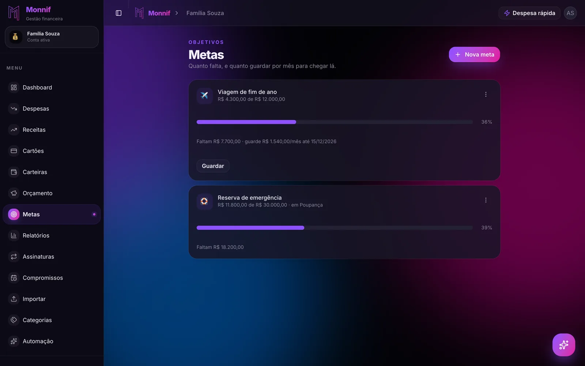

Pergunte a alguém quanto ela tem e você vai ouvir um número só. Pergunte **onde** esse dinheiro
está e a resposta leva trinta segundos, tem quatro itens e costuma mudar a conclusão da
primeira pergunta.

Essa diferença entre *quanto* e *onde* é o que a gestão de carteiras resolve. É o recurso mais
chato de explicar e o que mais muda o comportamento de quem finalmente separa.

## O saldo somado é uma mentira confortável

Um exemplo com números redondos:

| Onde está | Quanto |
|---|---|
| Conta corrente | R$ 1.200 |
| Poupança (reserva de emergência) | R$ 6.500 |
| Corretora | R$ 900 |
| Espécie na carteira | R$ 400 |
| **Total** | **R$ 9.000** |

Nove mil reais. É um número que dá sono tranquilo e autoriza uma compra.

Agora olhe a primeira linha. O mês vai ser pago com **R$ 1.200**. Os R$ 6.500 são a reserva, e
reserva que é usada para cobrir mês normal deixou de ser reserva — vira poupança de curtíssimo
prazo com nome bonito. Os R$ 900 da corretora podem levar dias para virar saldo. Os R$ 400 em
espécie somem sem deixar rastro, porque dinheiro vivo é o único que não tem extrato.

O total está certo e é inútil. Pior: ele é **otimista**, e otimismo em saldo é o erro que se
paga com fatura.

## Carteira não é cartão

Vale fixar isso antes, porque a confusão entre os dois é responsável por metade dos
lançamentos errados de quem está começando.

**Cartão é como você paga. Carteira é de onde o dinheiro sai.**

Comprar no crédito não tira dinheiro de nenhuma carteira no dia da compra — tira no dia em
que você paga a fatura, e aí sim sai de uma carteira. Por isso um app que trata cartão como
"mais uma carteira" erra o mês inteiro: ele debita hoje o que só vai sair daqui a quarenta
dias. Como o ciclo funciona de verdade está em
[sua fatura não segue o mês do calendário](/blog/ciclo-da-fatura/).

## Quantas carteiras, e quais

A resposta curta: **uma por lugar onde o dinheiro realmente fica, e uma por propósito que você
não quer misturar.**

O primeiro grupo é fácil, porque é físico:

| Tipo | O que costuma ser |
|---|---|
| Conta corrente | O dinheiro do dia a dia |
| Poupança | Reserva, dinheiro guardado |
| Dinheiro | Espécie na carteira física |
| Investimento | Aplicações, corretora |

O segundo grupo é o que separa quem controla de quem só registra. São carteiras que existem
porque **você decidiu que aquele dinheiro tem dono**:

- **Reserva de emergência** — cobre choque, não mês. Quanto e a partir de quando está em
  [reserva de emergência: quanto, onde e a partir de quando](/blog/fundo-de-emergencia/).
- **Colchão de renda** — para quem recebe valor variável, é a pilha que nivela o mês fraco.
  É diferente da reserva, e misturar as duas é o erro mais caro de quem trabalha por conta:
  [quando a renda muda todo mês, a média mente](/blog/renda-que-muda-todo-mes/).
- **Imposto** — o dinheiro do DAS, do carnê-leão ou do tributo sobre faturamento não é seu.
  Ele vai para a carteira dele **no dia em que o cliente paga**, não no dia do vencimento.
- **Meta** — a viagem, a troca do carro, a entrada do apartamento.

Não exagere. Doze carteiras que você não mantém são piores do que três que você mantém — cada
uma é um saldo a mais para conferir, e saldo desatualizado contamina a projeção inteira.

## O ponto de partida: o saldo de abertura

Toda carteira precisa de um valor inicial com uma data. É dali que a soma começa: entradas
somam, saídas subtraem, e o resultado é o saldo de hoje.

Parece burocracia e é a peça que mais quebra projeção. **Se o saldo de abertura está errado,
tudo o que vier depois está errado pelo mesmo valor, para sempre.** A correção certa é
arrumar o número na origem — não inventar um lançamento de "ajuste" de R$ 237, que vai
aparecer no relatório como se fosse um gasto real e sujar a média da categoria para sempre.

## A regra que quase todo mundo erra: transferência não é gasto

Esta é a mais importante do texto.

Tirar R$ 500 do corrente e pôr na poupança **não é uma despesa**. O seu patrimônio não mudou;
o dinheiro trocou de lugar. Da mesma forma, o dinheiro chegando na poupança **não é uma
receita**.

Se o app conta transferência como despesa e receita, três coisas quebram de uma vez:

1. **O gasto do mês incha.** Você "gastou" R$ 500 que continuam seus.
2. **A sobra do mês vira ficção.** Guardar dinheiro passa a parecer estourar o orçamento.
3. **O relatório por categoria fica inutilizável**, porque a maior categoria do ano vira
   "transferências".

O efeito colateral é comportamental e cruel: o app passa a **punir** você por guardar dinheiro.
Depois de três meses vendo a sobra afundar sempre que faz um aporte, a pessoa para de fazer
aporte, ou para de registrar. Nos dois casos o controle acabou.

Um app que trata isso direito tem uma operação de **transferir** que mexe só nos dois saldos e
não aparece em relatório de gasto nenhum.

## Espécie, PIX e o dinheiro que some

Duas fontes de buraco que a carteira resolve e o extrato não:

**Dinheiro vivo.** Saque de R$ 300 no extrato é uma linha só. Os R$ 300 viram feira, barbeiro,
gorjeta e estacionamento — quatro categorias que somem. A saída é tratar o saque como
transferência (corrente → carteira "Dinheiro") e lançar os gastos saindo dela. Dá um pouco de
trabalho e é a única forma de o dinheiro vivo existir no relatório.

**Conta secundária esquecida.** A conta do banco digital que recebe o PIX de um freela, a
conta antiga com R$ 180 parados, a carteira do aplicativo de transporte. Cada uma é dinheiro
seu fora da sua visão — e o que está fora da visão é gasto sem decisão.

## PF e PJ não se misturam

Para quem tem CNPJ, a regra é mais dura: **não são duas carteiras, são duas contas
financeiras.**

Misturar o dinheiro da empresa com o da casa é o que faz o pró-labore virar um número que
ninguém sabe dizer, e o que transforma "a empresa está indo bem" numa frase sem evidência.
Carteiras separadas dentro da mesma conta ajudam no dia a dia e não resolvem o relatório: você
quer poder olhar a casa sem a empresa no meio. Quem tem dois celulares resolve isso de uma vez
em [um WhatsApp para a casa, outro para a empresa](/blog/um-whatsapp-para-cada-conta/).

## Como isso fica no Monnif

Toda conta financeira nasce com uma carteira **Principal**, e você cria quantas mais fizerem
sentido. Cada [carteira](/docs/dia-a-dia/carteiras/) tem tipo — corrente, poupança, dinheiro,
investimento — e o tipo é rótulo e ícone: serve para você se achar, não muda cálculo nenhum.

**Transferir é uma operação própria.** Ela move dinheiro entre duas carteiras suas, não entra
em despesa nem em receita, não aparece nos [relatórios](/docs/planejamento/relatorios/) de
gasto e não mexe na sobra do mês. Só muda os dois saldos. É assim que "tirei do corrente e pus
na poupança" fica registrado sem sujar o número do mês.

**O saldo de abertura tem data** e é editável. Errou no começo, corrige ali — em vez de
inventar um lançamento de ajuste que ia virar gasto fantasma.

**O saldo somado de todas as carteiras alimenta a projeção.** É ele que a aba **Fluxo** do
[dashboard](/docs/dia-a-dia/dashboard/) usa para desenhar o caminho do dinheiro dia a dia e
apontar a data em que a conta cruza o zero. Carteira com saldo desatualizado desloca essa data
— motivo prático para não criar carteira que você não vai manter.

**Meta pode morar numa carteira.** Ligando a [meta](/docs/planejamento/metas/) a uma carteira,
o progresso passa a ser o próprio saldo dela: você transfere, a barra anda, e não existe aporte
manual para esquecer de registrar.

**Carteira que acabou não precisa ser apagada.** Arquivar tira ela dos seletores de lançamento
novo e mantém o histórico intacto, com os relatórios antigos corretos.

O plano grátis já vem com duas carteiras, e os [planos pagos](/precos/) sobem esse teto — mas o
raciocínio deste texto cabe em duas: uma para o mês, outra para o que não é do mês.

## O exercício de dez minutos

Liste, num papel, todo lugar onde você tem dinheiro agora. Conta corrente, poupança,
aplicativo de banco digital, corretora, espécie na carteira, o saldo daquele app de transporte.

Escreva o valor de cada um. Some.

Agora risque tudo que não pode ser usado para pagar as contas deste mês. O número que sobrou é
o seu saldo de verdade — e provavelmente é a primeira vez que você o vê.
