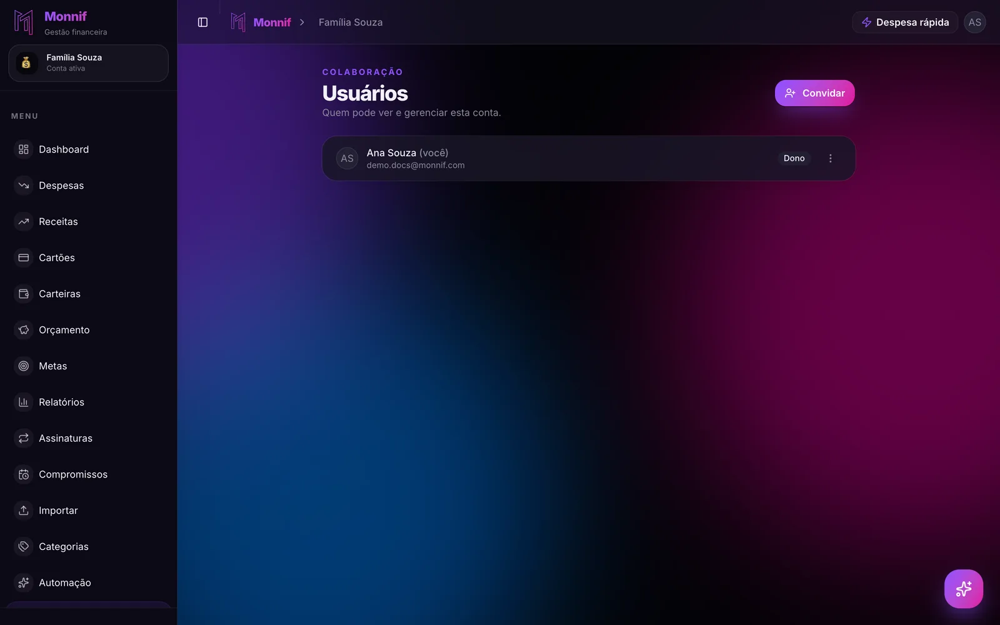
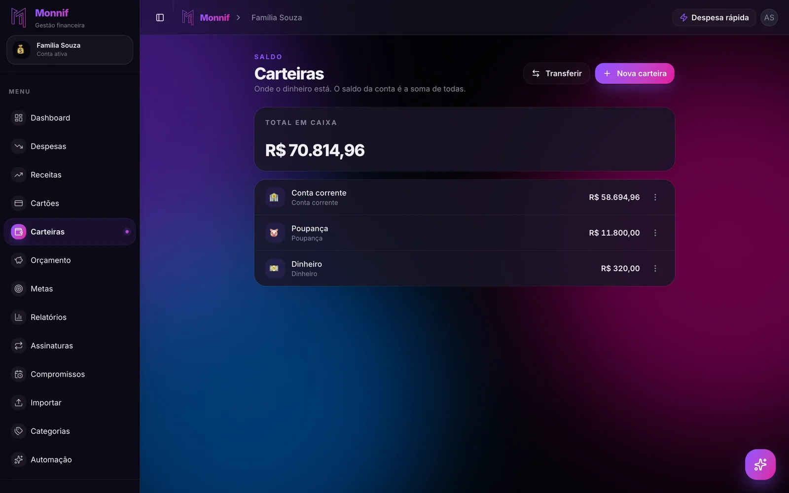
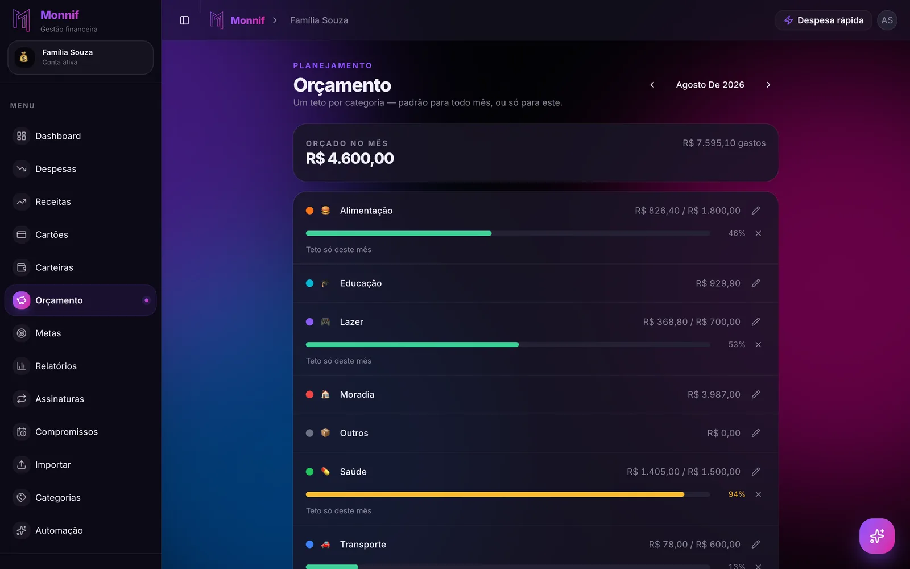

Quase todo aplicativo de gestão financeira é escrito para uma pessoa. Depois alguém pede para
usar a dois, e a solução que aparece na maioria deles é a mesma: **compartilhem o login.**

Funciona por uns dois meses. Depois começa o desgaste — e o desgaste quase nunca é sobre
dinheiro. É sobre quem anotou, quem esqueceu, quem viu o quê e quem virou o secretário da
casa sem ter se candidatado.

## O problema não é o app, mas o app pode piorar

Um casal que combinou as regras sobrevive a uma planilha ruim. Um casal que não combinou nada
não é salvo por app nenhum. Os três arranjos que costumam funcionar — tudo junto, tudo
separado com rateio, e proporcional à renda — estão em
[dinheiro a dois: o combinado importa mais que o app](/blog/dinheiro-a-dois/), e vale ler
antes de escolher ferramenta.

Dito isso: escolhida a regra, a ferramenta decide se manter a regra custa dois minutos por
dia ou uma discussão por mês. É sobre essa parte que este texto é.

## O que quebra num app de uma pessoa só

### Login compartilhado

Senha dividida parece detalhe e cobra caro. Ninguém troca a senha sem avisar, ninguém usa
biometria direito, e o app não tem como saber quem está do outro lado — então o lançamento
não tem autor. Quando aparece um gasto de R$ 340 que nenhum dos dois reconhece, não existe
onde olhar. A conversa vira memória contra memória, e memória sempre favorece quem fala mais
alto.

O que você quer é o oposto: **duas contas de acesso, uma conta financeira**. Cada um entra com
o seu e-mail e a sua senha, os dois veem os mesmos lançamentos, e cada linha carrega o nome de
quem a criou.

### Um celular só lança

No arranjo "login compartilhado", na prática um dos dois vira o responsável pela digitação. É
sempre a mesma pessoa, e ela não escolheu isso — foi ficando. Seis meses depois essa pessoa
está cansada e a outra não faz ideia de como o mês está indo, porque nunca precisou olhar.

Isso tem nome: **assimetria de informação**. É o que produz a frase "eu não sabia que a gente
estava assim", e ela raramente é mentira.

O remédio é simples de descrever e difícil de manter sem ferramenta: os dois precisam
conseguir lançar do próprio aparelho, no momento em que o gasto acontece, sem abrir nada.

### Nenhum lugar para o "quem deve o quê"

No arranjo separado com rateio, alguém paga o mercado e o outro devolve a metade. Essa conta
existe — o que muda é se ela mora num app ou na cabeça de alguém. Quando mora na cabeça, ela
some, e somem sempre as mesmas parcelas: as pequenas, e as de quem tem pior memória.

### Fiscalização em vez de controle

O erro simétrico do anterior. Num app que mostra tudo para os dois sem nenhuma válvula, cada
café de R$ 12 vira assunto. Casal que transforma orçamento em auditoria abandona o orçamento —
e o app junto.

Os arranjos que duram têm **um valor mensal por pessoa que não precisa de justificativa**.
Isso é uma decisão de combinado, mas o app precisa permitir: se ele não deixa você separar
"nosso" de "meu", ele está te empurrando para a fiscalização.

## As cinco perguntas de quem vai usar a dois

Se você já leu [as sete perguntas que eliminam quase todo app de gestão financeira](/blog/app-de-gestao-financeira/),
estas cinco são a camada de cima — valem só para quem não vai usar sozinho.

**1. Dá para os dois entrarem com logins diferentes na mesma conta?** Se a resposta envolve
dividir senha, o resto não importa.

**2. Dá para ver quem lançou o quê?** Não é desconfiança: é a única forma de corrigir um erro
sem acusar ninguém.

**3. Existem papéis diferentes?** Nem todo mundo precisa poder excluir a conta inteira ou
convidar gente. Na dúvida, comece pelo papel menor — subir depois é trivial.

**4. Cabe mais de uma conta financeira?** Muitos casais precisam de duas: a da casa e a
pessoal de cada um. Ou a da casa e a do CNPJ de quem trabalha por conta.

**5. Os dois conseguem lançar do próprio celular, sem abrir o app?** É a pergunta que decide
se o combinado sobrevive ao terceiro mês.

## Um detalhe que quase ninguém pensa antes: a saída

Casais terminam. É desconfortável de escrever num texto sobre app, e é exatamente por ser
desconfortável que ninguém verifica antes.

Verifique: **os dois conseguem exportar o histórico?** Remover alguém tira o acesso da pessoa
ou apaga o que ela lançou? Se remover apaga, você tem uma bomba-relógio — e ela também
explode na versão boa da história, quando alguém só quer sair da conta da casa porque mudou
de cidade.

O comportamento correto é o chato: **os lançamentos são da conta, não da pessoa.** Sai a
pessoa, fica o histórico.

## Como isso fica no Monnif

Conta compartilhada no Monnif é o padrão, não um extra de plano pago.

**Cada um entra com o seu login.** Você [convida por link](/docs/conta/usuarios/), a outra
pessoa cria (ou já tem) a conta dela, e a conta financeira da casa aparece na lista dela. As
senhas continuam sendo duas, a conta é uma só. São três papéis — **Dono**, **Admin** e
**Membro** — e o menor deles já lança, edita e vê tudo, sem poder mexer em quem entra e quem
sai.

**Cada linha tem autor.** O [histórico](/docs/dados/historico/) guarda o que foi criado,
editado ou apagado, por quem e a que horas. É onde a pergunta "de quem é esse gasto de R$ 340"
morre em dez segundos, sem virar conversa.

**Os dois lançam do próprio celular.** Dá para vincular **mais de um número de WhatsApp** à
mesma conta, um para cada pessoa — então o gasto entra na hora em que acontece, do aparelho de
quem gastou, por texto ou por áudio. Como vincular está em
[assistente no WhatsApp](/docs/assistente/whatsapp/), e o que dá e o que não dá para fazer por
mensagem está em [gestão financeira pelo WhatsApp](/blog/gestao-financeira-pelo-whatsapp/).
Uma coisa que **não** é compartilhada: a conversa de cada um com o assistente. Vocês veem os
mesmos lançamentos, não as mesmas conversas.

**O "nosso" e o "meu" cabem em carteiras separadas.** Para o arranjo com rateio, cada um
mantém a própria [carteira](/docs/dia-a-dia/carteiras/) visível sem virar caixa único — e a
transferência entre elas não conta como despesa, então acertar a metade do mercado não suja o
relatório do mês. O raciocínio inteiro está em
[gestão de carteiras](/blog/gestao-de-carteiras/).

**O combinado vira teto, não sermão.** O [orçamento](/docs/planejamento/orcamento/) por
categoria é o acordo escrito: o limite está lá, os dois veem a mesma barra, e ninguém precisa
lembrar o que foi combinado em março. Inclusive o valor pessoal de cada um, que é a válvula
que impede a fiscalização.

**Ninguém fica refém.** Remover alguém tira o acesso na hora e **os lançamentos ficam** — são
da conta. A exportação em CSV pelos [relatórios](/docs/planejamento/relatorios/) está no plano
grátis, que também cabe duas pessoas por conta sem pagar nada; os
[planos pagos](/precos/) sobem os limites e liberam a divisão de despesa entre as pessoas da
conta.

## Comece pela conversa, não pelo cadastro

Marquem trinta minutos, sempre no mesmo dia do mês, e respondam três perguntas: o que fugiu
do previsto, o que vem no mês que entra, e se alguma coisa precisa mudar no combinado.

O app serve para que essas trinta minutos tenham números em vez de impressões. Ele não
substitui a conversa — ele só garante que os dois estejam olhando a mesma tela quando ela
acontecer.
