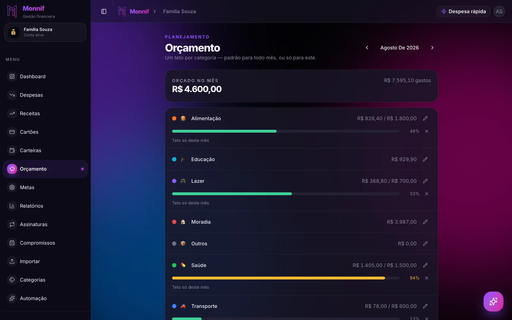

De todos os métodos de orçamento, a regra 50/30/20 é o que mais gente já tentou. Ela cabe
numa frase, não exige planilha e vem com números redondos que parecem justos.

É também o método que mais gente abandona na primeira vez que faz a conta — porque a
primeira conta costuma dar 74%.

## O que a regra 50 30 20 manda fazer

A ideia é dividir a **renda líquida** — o que cai na conta, depois de imposto e desconto —
em três fatias fixas:

| Fatia | O que entra | Em R$ 4.000 |
|---|---|---|
| **50% Essencial** | Moradia, mercado, transporte, contas da casa, saúde | R$ 2.000 |
| **30% Escolhas** | Delivery, streaming, bar, viagem, presente | R$ 1.200 |
| **20% Futuro** | Reserva, investimento e amortização de dívida | R$ 800 |

A regra nasceu em *All Your Worth*, livro de 2005 da americana Elizabeth Warren. O mérito
dela é real: ela substitui vinte e oito categorias por três decisões, e transforma "guardar
dinheiro" em uma linha do orçamento com valor definido, e não no que sobrar.

O problema não está na lógica. Está na aritmética de quem tenta aplicá-la aqui.

## A conta que quase todo mundo faz

Uma casa com R$ 4.000 líquidos por mês, em qualquer cidade média brasileira:

| Gasto | Valor |
|---|---|
| Aluguel + condomínio | R$ 1.450 |
| Mercado | R$ 900 |
| Transporte | R$ 320 |
| Luz, água, internet e celular | R$ 310 |
| **Total do essencial** | **R$ 2.980** |

São **74,5%** da renda em coisas que não são escolha. Sobram R$ 1.020 para dividir entre o
lazer e o futuro — a regra pedia R$ 2.000 nessa sobra.

Aqui acontece a parte que estraga tudo: a pessoa olha o resultado, conclui que está fazendo
tudo errado e fecha a planilha. O método que deveria organizar o dinheiro virou uma nota
baixa em uma prova que ela não tinha como passar.

Só que 74% não é um erro de comportamento. É a estrutura de custo de um país onde moradia,
comida e transporte pesam mais sobre a renda do que pesavam em Massachusetts em 2005.

## A regra é um termômetro, não uma meta

O jeito útil de usar o 50/30/20 é invertê-lo. Em vez de perguntar "como faço para caber
nos 50%?", pergunte **"em quanto eu estou hoje?"**.

O número que sai dessa conta — 74%, 63%, 81% — é a informação, e ela é boa mesmo quando é
feia. Ele responde três coisas de uma vez:

- **Quanto do seu mês já está decidido** antes de você acordar no dia 1º.
- **Quanto de folga real existe** para negociar, cortar ou guardar.
- **Se o problema é gasto ou é renda.** Acima de 75% no essencial, nenhum corte de delivery
  resolve. O ponteiro está em outro lugar: moradia, dívida ou quanto entra.

Essa distinção importa porque as duas situações pedem ações opostas. Quem está em 55%
precisa de disciplina no dia a dia. Quem está em 80% precisa de uma decisão grande — mudar
de aluguel, sair do rotativo, buscar renda extra — e vai perder meses tentando resolver com
força de vontade um problema que não é de força de vontade.

## Mova cinco pontos, não vinte e cinco

Um teto que exige heroísmo dura duas semanas. Vale para categoria e vale para proporção.

Se o seu essencial está em 74%, a meta do próximo trimestre não é 50%. É **69%**. Cinco
pontos de R$ 4.000 são R$ 200 por mês — um valor que cabe em uma renegociação de plano,
uma troca de mercado ou o corte de duas assinaturas, sem virar projeto de vida.

Cinco pontos por trimestre é o tipo de meta chata que ninguém posta no Instagram e que
funciona. É o mesmo motivo pelo qual
[quase todo orçamento falha no segundo mês](/blog/por-que-orcamento-falha/): o número foi
escolhido pelo que soava bonito, não pelo que descrevia a vida de quem ia cumprir.

## Os 20% não são o que sobra

A parte mais importante da regra é a mais fácil de ignorar: a fatia do futuro **sai
primeiro**, no dia em que o salário cai, e não no dia 30 com o que restou.

A diferença é psicológica e é decisiva. Dinheiro que continua na conta corrente até o fim do
mês é dinheiro disponível, e dinheiro disponível é gasto. Dinheiro transferido no dia 5 para
outro lugar simplesmente não participa das decisões do mês.

E se os 20% não couberem, guarde 7%. Uma reserva construída devagar existe; uma reserva
planejada em 20% e nunca iniciada não existe.

## Dívida cara vem antes de investimento

Um detalhe que a versão brasileira da regra precisa deixar explícito: **amortizar dívida
cara é a melhor aplicação disponível**, e ela entra dentro dos 20%.

Os juros do rotativo do cartão e do cheque especial são maiores do que qualquer rendimento
que você vai encontrar. Guardar R$ 500 rendendo perto do CDI enquanto R$ 500 rodam no
rotativo é perder dinheiro com organização impecável.

A única exceção razoável é manter um colchão pequeno — um mês de despesas — para não voltar
ao rotativo no primeiro imprevisto. Fora isso, dívida cara primeiro — e a ordem de ataque
tem [dois métodos possíveis](/blog/sair-das-dividas/).

## Aqui o ano tem treze salários e doze meses

A regra pressupõe doze meses iguais. O ano brasileiro não é assim: existe o 13º, existe o
terço de férias, e existem janeiro e fevereiro com IPTU, IPVA, material escolar e seguro
chegando juntos.

Tratar o 13º como bônus de fim de ano e depois se assustar em janeiro é o ciclo mais comum
do país. A correção é simples: **o dinheiro extra do ano paga as contas anuais do ano**.
O que sobrar depois disso é que é bônus — e aí ele entra nos 30% com a consciência limpa.

## Como descobrir a sua proporção real

Nada disso funciona com estimativa. "Acho que gasto uns R$ 700 de mercado" é o chute que
produz o orçamento que estoura.

O caminho mais rápido para o número verdadeiro é olhar para trás:
[importe o extrato](/docs/dados/importar/) dos últimos três meses em OFX ou CSV. Em cinco
minutos você tem histórico real, sem digitar lançamento nenhum.

Com o histórico dentro do app, os [relatórios](/docs/planejamento/relatorios/) mostram cada
categoria com o total do período, **ordenadas do maior gasto para o menor**. Somar as
categorias essenciais e dividir pela renda do mesmo intervalo dá a sua proporção — o
número que substitui o chute.

Para as [categorias](/docs/dados/categorias/), vale a mesma economia de esforço: as padrão
do Monnif — Alimentação, Moradia, Transporte, Saúde, Educação, Lazer — já se agrupam
sozinhas nas três fatias. Moradia, Alimentação e Transporte são o seu essencial; Lazer é a
sua fatia de escolhas.

Definido o alvo, o [orçamento](/docs/planejamento/orcamento/) é um teto mensal por
categoria, com quanto já foi e quanto ainda cabe. Não é preciso limitar todas: categoria
sem teto continua aparecendo, só não é cobrada. Coloque teto nas duas ou três que você
decidiu mover cinco pontos.

E a fatia do futuro vira uma [meta ligada a uma carteira](/docs/planejamento/metas/): você
transfere o valor no dia do salário e o progresso anda sozinho, sem você registrar aporte
nenhum. O dinheiro sai da conta corrente antes de virar decisão.

## O exercício de trinta segundos

Pegue o valor que caiu na sua conta no mês passado. Some o aluguel ou a prestação, o
mercado, o transporte e as contas da casa. Divida um pelo outro.

O resultado é o seu primeiro número, e ele vale mais do que qualquer regra decorada. Se deu
abaixo de 60%, o 50/30/20 é uma meta plausível para você e a questão é só disciplina. Se deu
acima de 70%, você não fracassou em nada — descobriu, com um mês de atraso em vez de cinco
anos, que a conversa que precisa acontecer é sobre moradia, dívida ou renda.

Nos dois casos, o método fez o trabalho dele. Ele nunca foi sobre chegar em 50. É sobre
saber em quanto você está.
