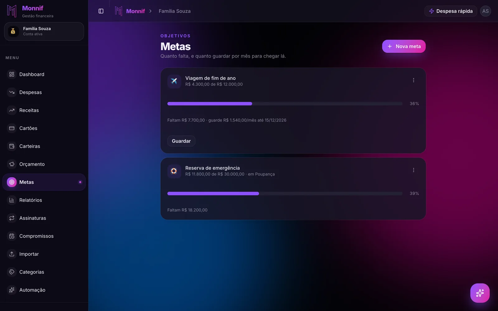
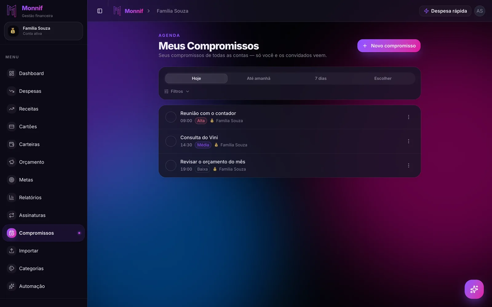

Quem tem cinco dívidas raramente tem um problema de disciplina. Tem um problema de **ordem**:
o dinheiro que sobra todo mês é espalhado igualmente entre todas elas, um pouco em cada,
e nenhuma nunca acaba.

Os dois métodos que resolvem isso são conhecidos e opostos. A **bola de neve** manda atacar
a menor dívida primeiro. A **avalanche** manda atacar a mais cara. Antes de escolher entre
eles, porém, existe uma conta de trinta segundos que muda a resposta.

## Quanto a sua dívida custa parada

A pergunta que quase ninguém faz não é "quanto eu devo". É **quanto essa dívida cobra por
mês para continuar existindo**.

Um retrato comum de uma casa endividada no Brasil:

| Dívida | Saldo | Juros ao mês | Só de juros, por mês |
|---|---|---|---|
| Rotativo do cartão | R$ 3.000 | 15% | R$ 450 |
| Cheque especial | R$ 1.200 | 8% | R$ 96 |
| Crediário da loja | R$ 800 | 6% | R$ 48 |
| Empréstimo pessoal | R$ 4.000 | 4% | R$ 160 |
| **Total** | **R$ 9.000** | | **R$ 754** |

São R$ 9.000 de saldo que cobram **R$ 754 por mês** só para ficarem do mesmo tamanho.

Agora some o efeito prático: se essa casa consegue destinar R$ 900 por mês para dívida,
R$ 754 vão embora em juros e **R$ 146 abatem o saldo**. Menos de um quinto do esforço está
diminuindo a dívida. Os outros quatro quintos estão pagando aluguel do dinheiro.

É por isso que a sensação de "pago todo mês e não anda" é literalmente verdadeira. Não é
impressão, é aritmética.

## Bola de neve: a menor primeiro

A bola de neve ordena as dívidas **do menor saldo para o maior**, ignorando as taxas. Você
paga o mínimo de todas e joga tudo o que sobra na menor. Quando ela morre, a parcela que
era dela entra na próxima — a bola cresce.

No exemplo acima, a ordem seria: crediário (R$ 800), cheque especial (R$ 1.200), rotativo
(R$ 3.000) e empréstimo (R$ 4.000).

A vantagem é comportamental e não é pouca coisa. Uma dívida a menos na lista é um resultado
visível em poucas semanas, e resultado visível é o que faz alguém continuar no quarto mês.
Quase todo plano financeiro morre por abandono, não por erro de cálculo — pelo mesmo motivo
que [quase todo orçamento falha no segundo mês](/blog/por-que-orcamento-falha/).

## Avalanche: a mais cara primeiro

A avalanche ordena pela **taxa de juros**, do maior para o menor, e ignora o tamanho do
saldo. Aqui a ordem seria: rotativo (15%), cheque especial (8%), crediário (6%) e empréstimo
(4%).

É o método matematicamente ótimo: quita menos parcelas no começo, mas derruba mais juros por
real pago, e por isso termina antes e mais barato.

A diferença fica clara olhando o que cada primeiro alvo devolve ao seu orçamento:

- matar o **crediário de R$ 800** libera R$ 48 por mês;
- matar o **rotativo de R$ 3.000** libera R$ 450 por mês.

Quase dez vezes mais folga, pela mesma disciplina e no mesmo prazo. A bola de neve entrega
uma vitória rápida; a avalanche entrega dinheiro.

## Qual dos dois usar

A escolha honesta depende de duas coisas — e nenhuma delas é preferência pessoal.

| Se... | Use |
|---|---|
| As taxas são parecidas (todas entre 3% e 6% ao mês) | Bola de neve |
| Existe uma dívida muito mais cara que as outras | Avalanche |
| Você já abandonou dois planos antes | Bola de neve |
| A menor dívida é também a mais cara | Os dois concordam — comece por ela |

A regra de bolso que funciona para a maioria é um híbrido: **tire da mesa toda dívida com
juros de dois dígitos ao mês, e depois faça bola de neve com o que sobrar.** Você captura o
ganho grande da avalanche e mantém o ritmo de vitórias da bola de neve.

E vale o lembrete óbvio: o método que você mantém ganha do método ótimo que você abandona.
Uma avalanche perfeita interrompida em março perde de uma bola de neve chata que chega em
dezembro.

## O rotativo não entra nessa discussão

Existe uma exceção que não é opinião. **Rotativo de cartão e cheque especial não competem
com nada** — eles saem primeiro, sempre, em qualquer método.

O rotativo é a linha de crédito mais cara do varejo brasileiro, na casa dos 400% ao ano. O
cheque especial tem teto legal de 8% ao mês, o que ainda dá cerca de 150% ao ano. Nenhuma
outra dívida da sua lista chega perto, e nenhum investimento disponível rende algo que
justifique deixar esse saldo rodando.

Três decisões práticas nesse ponto:

**Não pague o mínimo da fatura.** Pagar o mínimo *é* entrar no rotativo. O que não foi pago
volta no mês seguinte com juros, e o mês seguinte começa pior do que o anterior.

**Parcelar a fatura pelo banco é melhor que o rotativo.** Não é quitar a dívida, é trocá-la
por uma mais barata — normalmente algo perto de 8% ao mês contra os 15% do rotativo. Trocar
uma dívida cara por uma menos cara é progresso real, mesmo que o saldo não mude.

**Existe um teto.** Desde 2024, os juros e encargos da dívida de cartão de crédito não podem
ultrapassar o valor original da dívida. Quem deve R$ 3.000 não vai dever R$ 12.000 — mas vai
dever R$ 6.000, e chega lá rápido.

Se a origem do seu rotativo foram compras parceladas que se empilharam, vale entender o
mecanismo antes de repetir:
[em 10x sem juros, o mês que vem já está gasto](/blog/em-10x-sem-juros/).

## Trocar dívida cara por dívida barata

Antes de acelerar o pagamento, vale tentar reduzir o preço do que você já deve. É o único
movimento que melhora a conta sem exigir um real a mais por mês.

- **Renegocie direto com o credor.** Banco e loja preferem receber com desconto a não
  receber. Proposta à vista costuma abrir desconto grande no saldo.
- **Compare o CET, não a parcela.** Uma parcela menor em vinte e quatro meses pode custar
  muito mais no total. O número que compara duas propostas é o Custo Efetivo Total.
- **Considere crédito mais barato para quitar o mais caro.** Consignado e crédito com
  garantia custam uma fração do rotativo. A armadilha conhecida é quitar o cartão, sentir o
  alívio e voltar a usá-lo — aí a dívida existe duas vezes.

## A parcela precisa caber

A renegociação que estoura de novo em dois meses não foi um acordo, foi um adiamento com
assinatura. Antes de aceitar qualquer proposta, o número que importa é quanto **realmente**
sobra no seu mês — e esse número sai do orçamento, não da memória.

Se o seu essencial já consome mais de 70% da renda, o problema não se resolve só apertando
o lazer; é o que a conta da
[regra 50/30/20 aplicada ao salário brasileiro](/blog/regra-50-30-20/) mostra em cinco
minutos.

Uma última coisa contraintuitiva: mantenha **um mês de despesas guardado** enquanto paga a
dívida. Sem colchão nenhum, o primeiro imprevisto volta direto para o cartão e desfaz meses
de esforço. O resto da lógica está em
[reserva de emergência: quanto, onde e a partir de quando](/blog/fundo-de-emergencia/).

## Como isso fica no Monnif

Nada disso funciona com estimativa — e dívida é justamente o tipo de número que a memória
arredonda para baixo.

O caminho mais rápido para a lista verdadeira é
[importar o extrato](/docs/dados/importar/) em OFX ou CSV. Em alguns minutos você tem os
últimos meses lançados, com as parcelas e as cobranças de juros aparecendo onde elas de fato
estão.

Nos [cartões](/docs/dia-a-dia/cartoes/), a fatura é montada por ciclo de fechamento e a barra
de limite já conta as parcelas futuras contratadas — que é o único jeito de enxergar o
tamanho real do compromisso antes de assumir mais um. O
[dashboard](/docs/dia-a-dia/dashboard/), na aba Fluxo, projeta o saldo dia a dia e mostra a
data em que a conta cruza o zero.

As parcelas de um acordo entram em [Despesas](/docs/dia-a-dia/despesas/) com **repetição**
até a data de término. Lançadas uma vez, elas já nascem dentro dos próximos meses — e os
meses futuros passam a mostrar a verdade em vez do otimismo.

Para acompanhar o progresso, uma [meta](/docs/planejamento/metas/) sem carteira faz o
trabalho: o alvo é o valor total da dívida e cada abatimento entra como aporte, com data e
observação. A barra de progresso existe pelo mesmo motivo que a bola de neve funciona —
ver o número andar é o que sustenta o método até o fim.

E a ligação de renegociação, aquela que fica para segunda-feira desde março, cabe na
[agenda de compromissos](/docs/planejamento/compromissos/): data, hora, importância alta e
lembrete. Compromisso não tem valor e não entra em relatório nenhum — mas é o passo que
destrava os outros.

## O exercício de trinta segundos

Escreva as suas dívidas em uma lista com duas colunas: **saldo devedor** e **juros ao mês**.
Multiplique uma coluna pela outra, linha por linha, e some.

Esse total é quanto você paga por mês para a sua dívida ficar exatamente do mesmo tamanho.

Se ele for maior do que a metade do que você consegue destinar à dívida, nenhum método vai
resolver sozinho: a prioridade passa a ser trocar a dívida cara por uma mais barata, antes
de acelerar o pagamento. Se for bem menor, escolha o método que você vai conseguir manter e
comece pela primeira linha.

Os dois caminhos exigem a mesma coisa para começar: saber a taxa de cada dívida. É a
informação que ninguém decora e que muda tudo.
